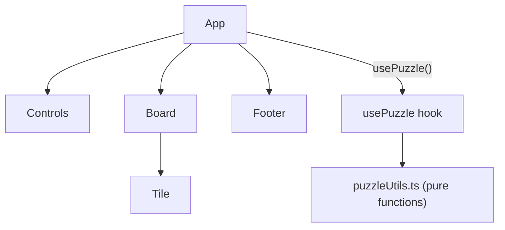

# slido

A classic sliding tile puzzle built with React 19 and TypeScript. Numbered tiles fill a cusotm grid; click any tile adjacent to the empty slot to slide it into place. The goal is to restore the sequence with the empty slot last.

## Tech stack

| Tool | Version | Purpose |
| --- | --- | --- |
| React | 19 | UI |
| TypeScript | 5.9 | Type safety |
| Vite | 7 | Dev server & bundler |
| Biome + Ultracite | 2.4.5 / 7.2.5 | Linting & formatting |
| Vitest | 4 | Unit testing |

---

## AI use disclaimer

AI use in this project was used as pair programming and its results approved only after being analysed.

**Cursor** was the IDE, so auto-complete code was used.
Architectural and general questions were done with **Gemini**.
**Claude Sonnet 4.6** was used for planning, README.md generation, function comments and unit tests.

---

## Thought process

Understanding how the sliding puzzle works before touching code.
What is a board? What is a tile?
Clicking a tile makes it move to gap.
You win when the tiles are all back in their correct places.

* Shuffling from a solved state is the safest way to ensure the user never gets frustrated by a broken game.

My initial plan was to create a 2D grid...

1D array is easier to manipulate than a nested array.

I tried to move around using row,col, but it was easier to do it with index. Row/col only for detecting if gap is neighbor.

Instead of using row/col AND index, I decided to just go with index instead for both moving AND detecting. It got too complex having to swap everything and the readability was just too confusing.

export const canMoveTile = (
  board: Tile[],
  clickedTileIndex: number
): boolean => {
  const emptyTileIndex = getEmptyTileIndex(board);
  return (
    clickedTileIndex === emptyTileIndex + 1 ||
    clickedTileIndex === emptyTileIndex - 1 ||
    clickedTileIndex === emptyTileIndex + GRID_SIZE ||
    clickedTileIndex === emptyTileIndex - GRID_SIZE
  );
};

findIndex is an $O(n)$ operation. Every time you click a tile, you are looping through the array to find the gap. So i'm gonna pass it down from usePuzzle.

All tiles were being rerendered on every click, even though they were wrapped in memo and the click prop was being passed with a useCallback. FUNCTIONAL STATE UPDATES were the answer

If you simply randomize the array, exactly 50% of the time, the puzzle will be impossible to solve. To avoid the embarrassment of a recruiter getting stuck on an unsolvable board, you have two choices:

The Math Way: Check the "Inversion Count" of the array (it’s a bit of a headache).

The Senior Way (The "Simulation" Shuffle): Start with a solved board and programmatically "click" a random valid neighbor 100–200 times. This guarantees the board is solvable because you’re just retracing valid steps.

---

## Solutions

Phase 1: Data Architecture (The "Model")
Phase 2: Headless Logic (The "Hook")
Phase 3: The "Skeleton" UI (The "View")

**Flat array as board state.** The board is represented as a single `Tile[]` rather than a 2D matrix. A flat array maps directly to a CSS Grid layout, simplifies React key management, and avoids nested loops in most operations.

**Tiles carry their own position.** Each `Tile` stores a `{ row, col }` coordinate. This means `canMoveTile` is pure coordinate arithmetic — no index-to-row/col conversion needed at the call site, and the logic reads like the actual game rule.

**Pure utility functions.** All game logic lives in `src/utils/puzzleUtils.ts` as plain functions with no side effects. They take state in, return new state out. This makes them straightforward to unit test in isolation.

**Single hook, dumb components.** `usePuzzle` owns all mutable state (`tiles`, `moves`, `isSolved`). Components receive data and callbacks as props and render nothing beyond what they are given. No Context API, no global store. The app is small enough that this is the right trade-off.

---

## Architecture



`App` calls `usePuzzle` and fans the resulting state and callbacks down one level to `Board` and `Controls`. No prop drilling beyond that depth.

### Component responsibilities

| Component | Responsibility |
| --- | --- |
| `App` | Composes layout; connects hook to children |
| `Board` | Renders the tile grid; forwards click index to `handleMove` |
| `Tile` | Single interactive tile; memoised to avoid unnecessary re-renders |
| `Controls` | New Game button; future home for grid-size switcher |
| `Footer` | Static attribution line |

---

## Core logic

All functions live in [`src/utils/puzzleUtils.ts`](src/utils/puzzleUtils.ts).

### `createBoard(gridSize)`

Builds the initial **solved** board as a flat array of `gridSize²` tiles. Values are 1-based integers in order; the last tile has `value: null` (the empty slot). Each tile's `position` is derived from its index.

```txt
index 0 → { value: 1, position: { row: 0, col: 0 } }
index 8 → { value: null, position: { row: 2, col: 2 } }
```

### `getEmptyTileIndex(board)`

`Array.findIndex` for the tile where `value === null`. Used internally by `canMoveTile` and `moveTile`.

### `canMoveTile(board, clickIndex)`

Pure coordinate adjacency check. A tile can move if and only if it shares exactly one side with the empty slot:

```txt
same row, col ± 1   →  horizontal neighbour
same col, row ± 1   →  vertical neighbour
```

Diagonal and non-adjacent tiles always return `false`.

### `moveTile(board, clickIndex)`

Immutable swap: spreads the board into a new array, then destructure-assigns the clicked tile and the empty slot. Returns the new array; the original is never mutated.

### `checkWin(tiles)`

Two-pass check:

1. Last tile must be `null`.
2. Every other tile at index `i` must have `value === i + 1`.

Short-circuits on the first failure.

### `shuffleBoard(board)` ⚠️

Currently a **stub** — returns the board unchanged. See [To-dos](#to-dos).

---

## State management

[`src/hooks/usePuzzle.ts`](src/hooks/usePuzzle.ts) is the single source of truth.

| State | Type | Description |
| --- | --- | --- |
| `tiles` | `Tile[]` | Current board |
| `moves` | `number` | Incremented on every legal move |
| `isSolved` | `boolean` | Locked to `true` after `checkWin` passes |

### `handleMove(clickIndex)`

1. Guard: returns early if `isSolved`.
2. Delegates to `canMoveTile`; no-ops on illegal clicks.
3. Increments `moves`, calls `moveTile`, updates `tiles`.
4. Calls `checkWin` on the new board; sets `isSolved` if it passes.

### `resetGame`

Reinitialises all three state values to their starting defaults.

---

## Types

Defined in [`src/types/index.ts`](src/types/index.ts).

```ts
type TileValue = number | null;

interface TilePosition { row: number; col: number; }

interface Tile { value: TileValue; position: TilePosition; }

type GameStatus = "idle" | "playing" | "won";

interface GameStats { moves: number; seconds: number; }

interface PuzzleState {
  bestScore: number | null;
  gridSize: number;
  moves: number;
  status: GameStatus;
  tiles: Tile[];
}
```

`GameStatus`, `GameStats`, and `PuzzleState` are defined but not yet wired into the application (see [To-dos](#to-dos)).

---

## Scripts

```bash
pnpm dev          # start dev server
pnpm build        # type-check + production build
pnpm preview      # preview production build
pnpm lint         # Biome check
pnpm lint:fix     # Biome check with auto-fix
pnpm test         # Vitest watch mode
pnpm coverage     # Vitest coverage report
```

---

## To-dos

* [ ] **Shuffle** — `shuffleBoard` is a stub. Implement Fisher-Yates shuffle with a solvability guard (inversion-count parity check) so the generated board is always reachable.
* [ ] **Tests** — Vitest is installed but no test files exist yet. Priority targets:
  * `createBoard` — correct length, values, positions
  * `canMoveTile` — adjacent returns `true`, diagonal/far returns `false`
  * `moveTile` — immutability, correct swap
  * `checkWin` — solved board passes, any other state fails
* [ ] **UI** — `Tile` currently renders raw debug text (`value (row, col)`). Needs visual styling; `Board.css` only sets `grid-template-columns`.
* [ ] **Move counter & win screen** — `moves` and `isSolved` are tracked in the hook but never rendered.
* [ ] **Timer** — `GameStats.seconds` is typed but no timer has been started.
* [ ] **Grid size switcher** — `Controls.tsx` has a placeholder comment; `PuzzleState.gridSize` is typed but `GRID_SIZE` is hardcoded to `3`.
* [ ] **Best score persistence** — `PuzzleState.bestScore` suggests `localStorage` storage; not yet implemented.
