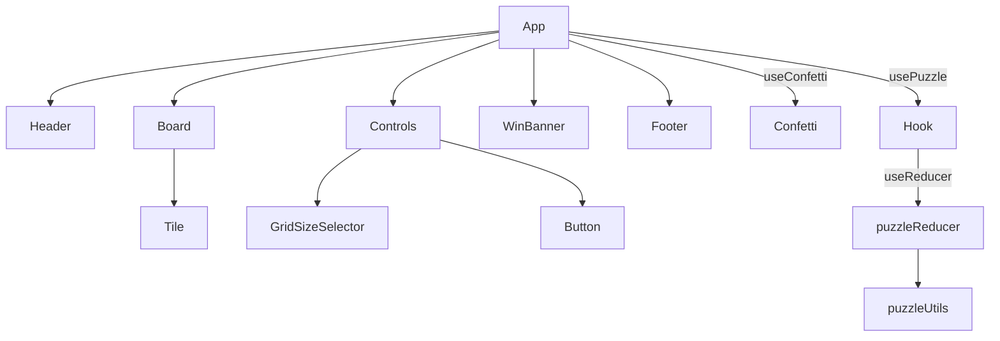

# slido

<p align="center" width="100%">
    
</p>

A classic sliding tile puzzle built with React 19 and TypeScript. Numbered tiles fill a custom grid; click any tile adjacent to the empty slot to slide it into place. The goal is to restore the sequence with the empty slot last.

## Tech stack

| Tool | Version | Purpose |
| --- | --- | --- |
| React | 19 | UI |
| TypeScript | 5.9 | Type safety |
| Vite | 7 | Dev server & bundler |
| Tailwind CSS | 4 | Utility-first styling |
| Motion | 12 | Tile slide animations |
| canvas-confetti | 1.9 | Win celebration |
| Biome + Ultracite | 2.4.5 / 7.2.5 | Linting & formatting |
| Vitest + RTL + vitest-axe | 4 / 16 | Unit, component & a11y testing |

---

## AI use disclaimer

AI use in this project was used as pair programming and its results approved only after being analysed.

**Cursor** was the IDE, so auto-complete code was used.
Architectural and general questions were done with **Gemini**.
**Claude Sonnet 4.6** was used for planning, README.md generation, JSDocs and unit tests.
**Claude Opus 4.6** was used to check the project and identify wrong design patterns, issues, uncaught bugs, points of improvement and senior-level code review and subsequent refactor (useReducer, accessibility, component tests, etc.).

---

## Thought process

### Getting the basics right first

Before writing any code, I spent time understanding how the game actually works: what is a board? What is a tile? When you click a tile, it slides into the empty gap. You win when all tiles are back in order with the empty slot last. Simple, but getting the data structure wrong would haunt me.

I originally planned a 2D grid (nested arrays), but a 1D flat array turned out to be much easier — it maps straight to CSS Grid, avoids nested loops, and keeps React keys simple. I also tried moving around with row/col coordinates, but mixing that with array indices got messy. In the end I went index-only for both moving and adjacency checks. Less mental overhead, and the code reads like the actual game rule.

### The shuffle trap (and how to avoid it)

If you naïvely randomize the numbers 1–8 with something like `array.sort(() => Math.random() - 0.5)`, 50% of the time the puzzle is unsolvable. A recruiter clicking "New Game" and getting stuck forever? Not a good look.

Two options: (1) The Math way — check inversion count and flip if the parity is wrong. A bit of a headache. (2) The simulation way — start from a solved board and programmatically "click" a random valid neighbor 100–200 times. You're literally replaying legal moves, so the result is always solvable. I went with the latter.

### The memo mystery

At some point I noticed all tiles were re-rendering on every click, even with `memo` and `useCallback`. Turned out the problem was `handleMove`: it had `tiles` in its dependency array. Every move updated `tiles`, so `handleMove` got a new identity every time — and `memo` on the tiles was useless. Moving the adjacency logic fully inside functional updates helped, but the real fix was switching to `useReducer`. `dispatch` never changes, so `handleMove` stays stable and only the two tiles that actually swap get re-rendered.

### Post–code review: what AI helped fix

I ran a senior-level code review on this project (with AI assistance) and got a pretty brutal but fair verdict: "Not ready to submit." The logic was solid, but a bunch of things would have tanked a take-home assessment.

So I used AI (Cursor + Claude) to work through the fix list: refactored to `useReducer`, fixed `resetGame`, added proper aria-labels and live regions, wired up the grid-size selector, added the win message, wrote Board component tests, trimmed unused CSS, added an error boundary (via `react-error-boundary` so we avoid class components), fixed `main.tsx` with a proper null-check, and synced the README with reality. The AI did the heavy lifting, but I reviewed and adjusted everything — the logic, the accessibility choices, and the structure all had to make sense.

---

## Solutions

**Flat array as board state.** The board is represented as a single `Tile[]` rather than a 2D matrix. A flat array maps directly to a CSS Grid layout, simplifies React key management, and avoids nested loops in most operations.

**Pure utility functions.** All game logic lives in [`src/features/puzzle/utils/puzzleUtils.ts`](src/features/puzzle/utils/puzzleUtils.ts) as plain functions with no side effects. They take state in, return new state out. This makes them straightforward to unit test in isolation.

**Reducer-based state management.** `usePuzzle` uses `useReducer` with [`puzzleReducer`](src/reducer/puzzleReducer.ts) that handles `MOVE`, `RESET`, and `CHANGE_GRID_SIZE` actions. The reducer is exported and tested directly as a pure function. `dispatch` has a stable identity, which means `memo(Tile)` actually works — only the two tiles involved in a swap re-render.

**Single hook, dumb components.** `usePuzzle` owns all mutable state. Components receive data and callbacks as props and render nothing beyond what they are given. No Context API, no global store. The app is small enough that this is the right trade-off.

---

## Architecture



`App` calls `usePuzzle` and fans the resulting state and callbacks down one level to `Board` and `Controls`. No prop drilling beyond that depth.

### Component responsibilities

| Component | Responsibility |
| --- | --- |
| `App` | Composes layout; connects hooks to children; renders `WinBanner` when solved |
| `Header` | Renders app title ("slido") |
| `Board` | Renders the tile grid as a CSS Grid `<section>` |
| `Tile` | Single interactive tile; memoised, animated with Motion `layout` |
| `Controls` | Move counter; delegates grid-size to `GridSizeSelector`, New Game to `Button` |
| `GridSizeSelector` | Radio group for 3×3 / 4×4 / 5×5 grid size selection |
| `Button` (ui) | Reusable primary button; used for "New Game" |
| `WinBanner` | Displays "Solved in N moves!" with `aria-live` when puzzle is won |
| `Footer` | Static attribution line |
| `react-error-boundary` | Catches runtime errors and renders fallback UI (no class components in app) |

---

## Core logic

All functions live in [`src/features/puzzle/utils/puzzleUtils.ts`](src/features/puzzle/utils/puzzleUtils.ts).

### `createInitialGameState(gridSize)`

Returns the full initial `GameState`: shuffled board (via `createBoard` + `shuffleBoard`), `moves: 0`, `status: "idle"`, and `gridSize`.

### `createBoard(gridSize)`

Builds the initial **solved** board as a flat array of `gridSize²` tiles. Values are 1-based integers in order; the last tile has `value: null` (the empty slot).

```txt
index 0 → { value: 1 }
index 8 → { value: null }
```

### `shuffleBoard(board, gridSize)`

Simulates 200 random legal moves from the solved state to produce a solvable starting board. This guarantees solvability without needing an inversion-count check.

### `getEmptyTileIndex(board)`

`Array.findIndex` for the tile where `value === null`.

### `canMoveTile(clickedIndex, emptyIndex, gridSize)`

Pure adjacency check. A tile can move if and only if it shares exactly one side with the empty slot. Handles row-boundary wrap prevention.

### `moveTile(board, clickedIndex, emptyIndex)`

Immutable swap: spreads the board into a new array, then destructure-assigns the clicked tile and the empty slot. Returns the new array; the original is never mutated.

### `checkWin(tiles)`

Checks whether tiles are ordered 1…n-1 with the empty tile last. Short-circuits on the first failure.

---

## State management

[`src/features/puzzle/hooks/usePuzzle.ts`](src/features/puzzle/hooks/usePuzzle.ts) is the single source of truth, built on `useReducer`. It imports [`puzzleReducer`](src/features/puzzle/reducer/puzzleReducer.ts) to handle all state transitions.

### `GameState`

| Field | Type | Description |
| --- | --- | --- |
| `tiles` | `Tile[]` | Current board |
| `moves` | `number` | Incremented on every legal move |
| `status` | `GameStatus` | `"idle"` / `"playing"` / `"won"` |
| `gridSize` | `GridSize` | Current grid size (3, 4, or 5) |

### `GameAction`

| Action | Payload | Effect |
| --- | --- | --- |
| `MOVE` | `clickedIndex` | Validates adjacency, swaps tiles, increments moves, checks win |
| `RESET` | — | Re-shuffles the board at the current grid size |
| `CHANGE_GRID_SIZE` | `gridSize` | Creates a fresh board at the new size |

### Why `useReducer` over `useState`

The original implementation used three coupled `useState` calls with a `useCallback` that depended on `tiles`. This caused `handleMove` to get a new identity on every move, defeating `memo` on all tiles. With `useReducer`, `dispatch` is inherently stable and all state transitions are co-located in a pure, testable reducer.

### Hooks

| Hook | Responsibility |
| --- | --- |
| `usePuzzle` | Owns game state; returns `tiles`, `moves`, `handleMove`, `resetGame`, `changeGridSize`, etc. |
| `useConfetti` | On `isSolved`, dynamically imports `canvas-confetti` and triggers celebration. Respects `prefers-reduced-motion`. |

---

## Accessibility

- **Tile labels:** Each numbered tile has an `aria-label` like "Tile 5, row 2, column 2"
- **Empty tile:** Rendered as a `<div aria-hidden="true">` (non-focusable, invisible to screen readers)
- **Move counter:** Uses `<output aria-live="polite">` to announce changes
- **Win announcement:** Uses `<output aria-live="polite" aria-atomic="true">` in `WinBanner` to announce the victory
- **Board:** `<section>` element with descriptive `aria-label`

---

## Types

Defined in [`src/features/puzzle/types/index.ts`](src/features/puzzle/types/index.ts).

```ts
type TileValue = number | null;
interface Tile { value: TileValue; }
type GridSize = 3 | 4 | 5;
type GameStatus = "idle" | "playing" | "won";
interface GameState {
  gridSize: GridSize;
  moves: number;
  status: GameStatus;
  tiles: Tile[];
}
type GameAction =
  | { type: "MOVE"; clickedIndex: number }
  | { type: "RESET" }
  | { type: "CHANGE_GRID_SIZE"; gridSize: GridSize };
```

---

## Scripts

```bash
pnpm dev          # start dev server
pnpm build        # type-check + production build
pnpm preview      # preview production build
pnpm check        # Ultracite check
pnpm fix          # Ultracite fix
pnpm test         # Vitest watch mode
pnpm coverage     # Vitest coverage report
```

---

## Future improvements

- **Arrow navigation:** Navigate the board using the keyboard arrows
- **Best score persistence:** Save best scores to `localStorage` per grid size
- **Custom tiles:** Allow the user to upload their own image to be displayed instead of numbers
- **Dark mode:** Wire up the existing CSS custom property dark theme
- **Integration tests:** Include tests using Playwright
